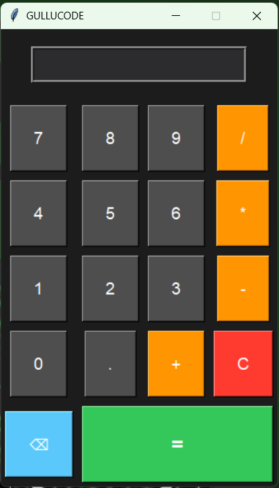

# 🧮 GULLUCODE Calculator (Python Project)

A simple and modern **Calculator Application built using Python**, featuring a clean dark UI and basic arithmetic operations.  
This project is beginner-friendly and ideal for learning GUI-based Python development.

---

## 📌 Features

- ➕ Addition  
- ➖ Subtraction  
- ✖ Multiplication  
- ➗ Division  
- 🔢 Decimal support  
- 🔄 Clear (C) button  
- ⌫ Backspace functionality  
- 🎨 Dark themed modern UI  

---

## 🖥️ Screenshot

> 📌 *Make sure to upload the screenshot image in your GitHub repository with the name `screenshot.png`.*

---

## 🛠️ Technologies Used

- **Python 3**
- **Tkinter** (for GUI)

---

## 📂 Project Structure

